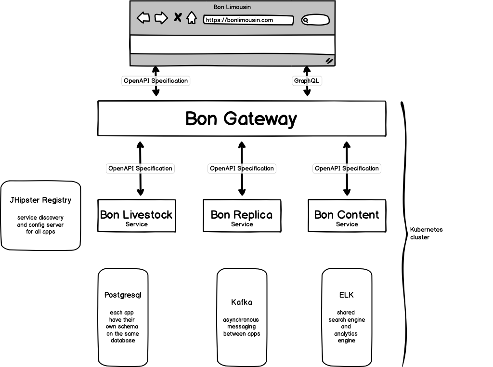

# bonParent

Independent parent project for holding common configuration and documentation for its children:
* https://github.com/frostmarked/bonGateway
* https://github.com/frostmarked/bonReplicaService
* https://github.com/frostmarked/bonLivestockService
* https://github.com/frostmarked/bonContentService

## Overview

Im going to create an over-engineered website for my cows!<br/>
Why? Learning by doing!

Its located on https://limousin.se <br>
JHipster Registry on https://registry.limousin.se and the <br>JHipster Console on https://console.limousin.se<br>
My production k8s cluster (or is it a playground cluster??) is running on https://www.scaleway.com<br>
CI/CD with the help of GitHub Actions <br>
Static code analysis from https://sonarcloud.io/ <br>
Performance boost is provided by https://www.cloudflare.com/
<br><br><br>


[JHipster](https://www.jhipster.tech/) and [JHipster JDL](https://www.jhipster.tech/jdl) will be the backbone in powering the below sketch of the planned architecture.<br/>
https://github.com/frostmarked/bonParent/blob/master/com-bonlimousin-jhipster-jdl.jdl

Hopefully I will make time to keep the documentation up-to-date of my findings during development with JHipster, good and OFI (opportunity for improvement). Also going to keep the project and its code as open as possible. 
Currently a few kubernetes files (secrets, config-maps) that is not in any repository.

The plan is to stay as close as possible to default and best practice, according to JHipster docs.<br/>
But every now and then Ill probably try something different. See [Slightly different trail](#differenttrail)



## Projects
Purpose of each project and maybe a few notes about tech, beyond what can be read at [JHipster](https://www.jhipster.tech/) 

Sonar Cloud is setup for all projects
https://sonarcloud.io/organizations/frostmarked/projects

Of course the plan is to pass the sonar quality gate. We will see how much effort I want to put into that...

### Bon Gateway
UI that displays my cattle to the public.

Signed in mode for specfic users that get access to enhanced data and functions.

BFF (Backend-for-frontend) setup so that the APIs can provide aggregated data from the downstream services.

https://github.com/frostmarked/bonGateway


[](https://sonarcloud.io/dashboard?id=frostmarked_bonGateway)

### Bon Replica Service
Provides a clone of data from the central swedish registry for domestic animals.

https://github.com/frostmarked/bonReplicaService


[](https://sonarcloud.io/dashboard?id=frostmarked_bonReplicaService)

### Bon Livestock Service
Additional data about cows that is of more or less interest. e.g. images etc

https://github.com/frostmarked/bonLivestockService


[](https://sonarcloud.io/dashboard?id=frostmarked_bonLivestockService)

### Bon Content Service
Very small and simple CMS that can hold some kind of newsworthy text.

https://github.com/frostmarked/bonContentService


[](https://sonarcloud.io/dashboard?id=frostmarked_bonContentService)

## Slightly different trail
<a name="differenttrail"></a>

### Parent project
This project, bonParent, i think is a better way of keeping track of shared files for and from JHipster that dont belong in any specfic project. It also give me a place to gather my documentation that is not project specfic. And as a bonus I could build all project using standard maven mechanics. Why would I do that? Well, in the future I plan to create end-to-end tests in this project.

### Kubernetes
One database to rule them all. By default I get 4 postgresql and then my computer dies... <br/>
Locally and in production ill be using one db with 4 schemas.<br/>
Prod environmet is hosted by https://www.scaleway.com/ and provides managed kubernetes and managed postgresql.<br/>
https://github.com/frostmarked/bonParent/tree/master/k8s

PullPolicy is set to always. Not sure if that is necessary or good.<br>
Anyway, the plan was to always run version latest and just redploy by doing
```
kubectl rollout restart deployment/bongateway -n bonlimousin
```
if it exists a newer version.

*TODO*<br>
Probably time to revert this pull policy change. All release pipelines are setup and stable.

### Docker-compose for bonGateway
WIP: Made my own docker-compose file for running all docker images except the gateway in some hybrid mode so they can communicate. Still need some testing ...<br/>
Why? Lazy way of starting all others apps so development can begin and end faster. 

### GraphQL
Currently the plan is to make use of GraphQL. The schema is a pure translation of the websites public OAS. That is built using [Doing API-First development](https://www.jhipster.tech/doing-api-first-development/).

Using https://github.com/IBM/openapi-to-graphql/ for translation of OAS.

Using https://www.apollographql.com/docs/angular/ as client-side lib<br>
plus https://graphql-code-generator.com/ for generating typescript from graphql schema

Using https://www.graphql-java-kickstart.com/spring-boot/ as server-side lib<br>
plus https://github.com/kobylynskyi/graphql-java-codegen/tree/master/plugins/maven for generating java from schema

**Note** 
GraphQl with kickstart breaks regular test environment.
Handle for now according to issue on github
https://github.com/graphql-java-kickstart/graphql-spring-boot/issues/230
```
spring:
  autoconfigure:
    exclude:
      - graphql.kickstart.spring.web.boot.GraphQLWebAutoConfiguration
      - graphql.kickstart.spring.web.boot.GraphQLWebsocketAutoConfiguration
```

and use @GraphQLTest annotation on test class

More information can be found in https://github.com/frostmarked/bonGateway/blob/master/README.md#doing-graphql-with-oas-spec
<br><br>


### Only admins can register new users
Disabled public registration of new users. The website will have a signed in mode eventually but I only want certain people to have access, without invite email.<br/>
By toggling a boolean spring property its back to default.<br/>

### Maven CI Friendly Versions
Implemented https://maven.apache.org/maven-ci-friendly.html

### GitHub Actions
Modified the result from
```
jhipster ci-cd
```

The pipeline take different routes depending on if its triggered by a release or not.<br/>
Except for difference in versioning of artifact and image the release flow will rollout a new version to given kubernetes cluster.

### Liquibase with spring profile prod
Puh... the app did not start... why why why???

You might think it did not start due to something with eureka and the discovery client. 
After all the last bit of information you get from the log is:  
```
2020-07-25 09:16:18.793  INFO 1 --- [nfoReplicator-0] com.netflix.discovery.DiscoveryClient    : Saw local status change event StatusChangeEvent [timestamp=1595668578792, current=UP, previous=STARTING]
2020-07-25 09:16:18.806  INFO 1 --- [nfoReplicator-0] com.netflix.discovery.DiscoveryClient    : DiscoveryClient_BONGATEWAY/bongateway:f33e529ccc6fdd5eebba10e2679c4082: registering service...
2020-07-25 09:16:19.099  INFO 1 --- [nfoReplicator-0] com.netflix.discovery.DiscoveryClient    : DiscoveryClient_BONGATEWAY/bongateway:f33e529ccc6fdd5eebba10e2679c4082 - registration status: 204
2020-07-25 09:16:19.205  INFO 1 --- [           main] c.b.gateway.config.WebConfigurer         : Web application configuration, using profiles: prod
2020-07-25 09:16:19.206  INFO 1 --- [           main] c.b.gateway.config.WebConfigurer         : Web application fully configured
2020-07-25 09:16:27.795  INFO 1 --- [trap-executor-0] c.n.d.s.r.aws.ConfigClusterResolver      : Resolving eureka endpoints via configuration
2020-07-25 09:16:42.797  INFO 1 --- [trap-executor-0] c.n.d.s.r.aws.ConfigClusterResolver      : Resolving eureka endpoints via configuration
2020-07-25 09:16:43.523  WARN 1 --- [scoveryClient-0] c.netflix.discovery.TimedSupervisorTask  : task supervisor timed out

java.util.concurrent.TimeoutException: null
	at java.base/java.util.concurrent.FutureTask.get(Unknown Source)
	at com.netflix.discovery.TimedSupervisorTask.run(TimedSupervisorTask.java:68)
	at java.base/java.util.concurrent.Executors$RunnableAdapter.call(Unknown Source)
	at java.base/java.util.concurrent.FutureTask.run(Unknown Source)
	at java.base/java.util.concurrent.ScheduledThreadPoolExecutor$ScheduledFutureTask.run(Unknown Source)
	at java.base/java.util.concurrent.ThreadPoolExecutor.runWorker(Unknown Source)
	at java.base/java.util.concurrent.ThreadPoolExecutor$Worker.run(Unknown Source)
	at java.base/java.lang.Thread.run(Unknown Source)

```

Dont be fooled like me...
Its actually liquibase that found a lock. 
But! the default setup from jhipster makes that very important piece of info go away in silence. 
Or should I blame Liquibase?... is it not obvious that it should be a warning???
Anyway setting logging in prod profile to DEBUG solved the mystery.

```
2020-07-25 09:25:29.166  INFO 1 --- [           main] liquibase.executor.jvm.JdbcExecutor      : SELECT COUNT(*) FROM public.databasechangeloglock
2020-07-25 09:25:29.172  INFO 1 --- [           main] liquibase.executor.jvm.JdbcExecutor      : SELECT COUNT(*) FROM public.databasechangeloglock
2020-07-25 09:25:29.180  INFO 1 --- [           main] liquibase.executor.jvm.JdbcExecutor      : SELECT LOCKED FROM public.databasechangeloglock WHERE ID=1
2020-07-25 09:25:29.187  INFO 1 --- [           main] l.lockservice.StandardLockService        : Waiting for changelog lock....
```

Probably the container/app got terminated in a bad state. Unlock Liquibase with:
```
UPDATE DATABASECHANGELOGLOCK SET LOCKED=false, LOCKGRANTED=null, LOCKEDBY=null where ID=1;
```

From now on I will explicitly set logging level in prod profile to: 

```
logging:
  level:
    ROOT: INFO
    io.github.jhipster: INFO
    com.bonlimousin.gateway: INFO
    liquibase: INFO
```

Or should I use logback-spring.xml ?

### Kafka with spring-kafka
I guess there is a good explanation to why jhipster does not use spring-kafka.<br/>
Due to I have not figured that out I will use spring-kafka. 
Can not see any point in writing code that has already been written.<br/> 
The change pretty much boils down to:

Swap kafka-clients dependency for 
```
<dependency>
	<groupId>org.springframework.kafka</groupId>
	<artifactId>spring-kafka</artifactId>
</dependency>
```

And use existing KafkaProperties for config of templates and listeners 
```
@Configuration
public class KafkaConfiguration {

	@Autowired
	private KafkaProperties kafkaProperties;

	@Bean
	public ProducerFactory<String, Object> producerFactory() {
		return new DefaultKafkaProducerFactory<>(kafkaProperties.getProducerProps());
	}

	@Bean
	public KafkaTemplate<String, Object> kafkaTemplate() {
		return new KafkaTemplate<>(producerFactory());
	}

	@Bean
	public ConsumerFactory<String, Object> consumerFactory() {
		return new DefaultKafkaConsumerFactory<>(kafkaProperties.getConsumerProps());
	}

	@Bean
	public ConcurrentKafkaListenerContainerFactory<String, Object> kafkaListenerContainerFactory() {
		ConcurrentKafkaListenerContainerFactory<String, Object> factory = new ConcurrentKafkaListenerContainerFactory<>();
		factory.setConsumerFactory(consumerFactory());
		return factory;
	}
}
``` 

### Testing with Kafka
It exists a few reasonable tools and strategies. And yes, testcontainers kafka seems superior.<br/>
```
<dependency>
	<groupId>org.testcontainers</groupId>
	<artifactId>kafka</artifactId>
	<scope>test</scope>
</dependency>
```

I thought it was obvious at first but had to iterate several times 
before deciding for below solution.

Created a test config that will hi-jack kafkaproperties 
and override bootstrap-servers property, if kafkacontainer is running. 
```
@TestConfiguration
public class KafkaTestConfiguration {
	
	public static boolean started = false;
	public static KafkaContainer kafkaContainer;
	
    @Autowired
    public void kafkaProperties(KafkaProperties kafkaProperties) {
    	if(started) {
    		kafkaProperties.setBootStrapServers(kafkaContainer.getBootstrapServers());	
    	}
    }
    
    public static void startKafka() {
    	kafkaContainer = new KafkaContainer("5.5.0").withNetwork(null);
        kafkaContainer.start();
        started = true;
    }
    
    public static void stopKafka() {
    	if(started) {
    		kafkaContainer.stop();
    	}
    }
}
```

The test class will then use it as follows.<br/>
Note: Remember to consumer.commitSync(); if you plan to have several tests so the previous records 
do not linger around
```
@SpringBootTest(classes = { BonReplicaServiceApp.class, KafkaTestConfiguration.class })
class MyKafkaIT {

	@Autowired
	private ConsumerFactory<String, Object> consumerFactory;

	@BeforeAll
	public static void setup() {
		KafkaTestConfiguration.startKafka();
	}
	
	@Test	
	@Transactional
	void testA() {
		// trigger broadcasting of topic
		ConsumerRecords<String, Object> records = consumeChanges();				
		assertThat(records.count()).isEqualTo(1);
		ConsumerRecord<String, Object> record = records.iterator().next();
		assertEquals("CREATE", record.key());
		// and so on...	
	}
	
	private ConsumerRecords<String, Object> consumeChanges() {
		Consumer<String, Object> consumer = consumerFactory.createConsumer();		
		consumer.subscribe(Collections.singletonList("MY_TOPIC"));
		ConsumerRecords<String, Object> records = consumer.poll(Duration.ofSeconds(2));
		consumer.commitSync();
		consumer.unsubscribe();
		consumer.close();
		return records;
	}
	
	@AfterAll
	public static void tearDown() {
		KafkaTestConfiguration.stopKafka();
	}
}
```

### Entity change emitter
The apps uses Kafka and the jhipster module Entity Audit with Javers, 
https://www.jhipster.tech/modules/marketplace/#/details/generator-jhipster-entity-audit.<br/>

What can we do of that? Broadcast changes!<br/>

Javers has pointcuts on spring repositories. 
So I will have a pointcut on javers and piggy back on its functionality. 
```
@Component
@Aspect
@Order(Ordered.LOWEST_PRECEDENCE)
public class EntityChangeJaversAspect {

	private final EntityChangeService entityChangeService;

	public EntityChangeJaversAspect(EntityChangeService entityChangeService) {
		this.entityChangeService = entityChangeService;
	}

	@AfterReturning(pointcut = "execution(public * commit(..)) && this(org.javers.core.Javers)", returning = "commit")
	public void onJaversCommitExecuted(JoinPoint jp, Commit commit) {
		this.entityChangeService.broadcastEntityChange(commit);
	}
} 
```

A simple service for checking if there were any changes? 
and if so transform javers commit and send it with kafka
```
@Service
public class EntityChangeService {

	private final Logger log = LoggerFactory.getLogger(EntityChangeService.class);

	private final KafkaTemplate<String, EntityChangeVO> kafkaTemplate;

	public EntityChangeService(KafkaTemplate<String, EntityChangeVO> entityChangeKafkaTemplate) {
		this.kafkaTemplate = entityChangeKafkaTemplate;
	}

	public void broadcastEntityChange(Commit commit) {
		if (commit.getSnapshots().isEmpty()) {
			return;
		}
		CdoSnapshot snapshot = commit.getSnapshots().get(0);
		EntityChangeVO vo = CdoSnapshotToEntityChangeVOConverter.convert(snapshot, new EntityChangeVO());
		String topic = "ENTITY_CHANGE_" + getManagedTypeSimpleName(snapshot).toUpperCase();
		String key = vo.getAction();
		send(new ProducerRecord<>(topic, key, vo));
	}
	
	public void send(ProducerRecord<String, EntityChangeVO> record) {			
		kafkaTemplate.send(record).addCallback(
				result -> log.debug(
						"Sent entity-change-topic {} with key {} and changes to params {} with resulting offset {} ",
						record.topic(), record.key(), record.value().getChangedEntityFields(), result.getRecordMetadata().offset()),
				ex -> log.error("Failed to send entity-change-topic {} with key {} and changes to params {} due to {} ",
						record.topic(), record.key(), record.value().getChangedEntityFields(), ex.getMessage(), ex));
	}

	protected static String getManagedTypeSimpleName(CdoSnapshot snapshot) {
		String className = snapshot.getManagedType().getName();
		return className.substring(className.lastIndexOf('.') + 1);
	}

}
```

Note: code is currently in bonReplicaService and a listener in bonLivestockService.
Note2: the emit might be "false-positive". Depending on the entity change belongs to a transaction 
that later on will roll back so will the javers commit. And you will end up with no trace in db of given sent out data.   


### Prototype - Ahead of time (or JIT) responsive images
I like to have all data in the database, which includes images. Lazy and simple.<br>
I also like html5 srcset for images. The browser can pick a suitable image depending on 
device and context.<br>
So, instead of returning a high resolution image encoded in base64 every time. I use Thumbnailator
```
<dependency>
	<groupId>net.coobird</groupId>
	<artifactId>thumbnailator</artifactId>
	<version>${net.coobird.thumbnailator.version}</version>
</dependency>
```

Not sure if its a valid plan to use bootstrap containers max width as base for image size... <br>
For now it will have to do
```
public enum PictureSize {
	ORIGINAL(null), SMALL(540), MEDIUM(720), LARGE(960), XL(1140);
```

Currently its very simple. If no image exist on disk, create it 
```
Path path = Paths.get(imageBaseDir, imageName);
if (!Files.exists(path)) {
	try (ByteArrayInputStream bais = new ByteArrayInputStream(image)) {
		if (pictureSize.pixelWidth() != null) {
			Thumbnails.of(bais).width(pictureSize.pixelWidth()).toFile(path.toFile());
		} else {
			Thumbnails.of(bais).scale(1).toFile(path.toFile());
		}
	}
}
```

The public APIs (rest and graphql) will from now on return several urls instead of a base64 string.<br>
A directive can help with populating the img attributes, srcset and src.  
```
import { Directive, ElementRef, Input, Renderer2, OnChanges } from '@angular/core';
import { PictureVo, Maybe } from '../../bonpublicgraphql/bonpublicgraphql';
import { pickPictureSourceUrl } from 'app/shared/bon/picturevo-util';

@Directive({
  selector: '[jhiCowPicture]',
})
export class CowPictureDirective implements OnChanges {
  @Input('jhiCowPicture')
  picture?: Maybe<PictureVo>;
  @Input()
  targetWidth?: string;

  constructor(private renderer: Renderer2, private el: ElementRef) {}

  ngOnChanges(): void {
    if (this.picture?.sources) {
      const tw = this.targetWidth ? parseInt(this.targetWidth, 10) || 992 : 992;
      const imgSrc = pickPictureSourceUrl(this.picture.sources, tw);
      this.renderer.setAttribute(this.el.nativeElement, 'src', imgSrc);

      const imgSrcSet = this.picture?.sources
        .filter(ps => ps && ps.url !== imgSrc)
        .map(ps => `${ps!.url} ${ps!.width}w`)
        .join(',');
      this.renderer.setAttribute(this.el.nativeElement, 'srcset', imgSrcSet);
    }
  }
}

```

Note: Perhaps the image should be stored to a persistent volume instead of java.io.tmpdir <br>
Note2: Ingress/nginx will probably have a low/default value for request body size. Handle it with an annotation
```
apiVersion: networking.k8s.io/v1beta1
kind: Ingress
metadata:
  name: bongateway
  namespace: bonlimousin
  annotations:
    nginx.ingress.kubernetes.io/proxy-body-size: 8m
spec:
  rules:
``` 

### Picsum Photos

Lorem ipsum photos from Picsum is great for developing. Beware that the JHipster Content Security Policy settings is tight. As it should be.
But just adding picsum.photos as image source is not enough. Picsum also uses subdomains so change CSP img-src accordingly

e.g.
````
img-src 'self' https://picsum.photos https://*.picsum.photos data:;
````

### HTTP Spinner aka API Spinner aka HTTP API Loader

So much asynchronous stuff going on... in order to visualize that I decided to add a simple bootstrap spinner when calls are made to either API, REST or GraphQL.

Steal with pride is always my first strategy! After a few minutes of inspiration from several blogs I decided to implement 
https://medium.com/swlh/angular-loading-spinner-using-http-interceptor-63c1bb76517b . <br>
While looking at the result I saw OFIs (opportunity for improvement). Main differences are:
1. In the service, store the number of requests to an url, instead of a boolean. Why? Actually no point storing a boolean, could use a list instead. But most of all, lots of request will go to the same url --> graphql endpoint
1. No custom spinner, just plain old bootstrap
1. No subscription, let angular handle the observable with a async pipe
1. The interceptor should use the rxjs operator tap, instead of map and catchError

The result was

```
import { Injectable } from '@angular/core';
import { BehaviorSubject } from 'rxjs';

@Injectable({
  providedIn: 'root',
})
export class SpinnerService {
  spinnerSubject: BehaviorSubject<boolean> = new BehaviorSubject<boolean>(false);
  requestMap: Map<string, number> = new Map<string, number>();

  constructor() {}

  addRequest(url: string): void {
    if (!url) {
      console.warn('URL is missing');
      return;
    } else if (!url.includes('api/') && !url.includes('graphql')) {
      return;
    }
    const n = this.requestMap.get(url) || 0;
    this.requestMap.set(url, n + 1);
    this.spinnerSubject.next(true);
  }

  removeRequest(url: string): void {
    if (!url) {
      console.warn('URL is missing');
      return;
    }
    const n = this.requestMap.get(url) || 0;
    if (n > 1) {
      this.requestMap.set(url, n - 1);
    } else {
      this.requestMap.delete(url);
    }

    if (this.requestMap.size === 0) {
      this.spinnerSubject.next(false);
    }
  }
}
```

```
import { Injectable } from '@angular/core';
import { HttpRequest, HttpHandler, HttpEvent, HttpInterceptor, HttpResponse } from '@angular/common/http';
import { Observable } from 'rxjs';
import { tap } from 'rxjs/operators';
import { SpinnerService } from 'app/shared/bon/spinner/spinner.service';

@Injectable()
export class SpinnerInterceptor implements HttpInterceptor {
  constructor(private spinnerService: SpinnerService) {}

  intercept(request: HttpRequest<any>, next: HttpHandler): Observable<HttpEvent<any>> {
    this.spinnerService.addRequest(request.url);
    return next.handle(request).pipe(
      tap(
        (evt: HttpEvent<any>) => {
          if (evt instanceof HttpResponse) {
            this.spinnerService.removeRequest(request.url);
          }
          return evt;
        },
        () => {
          this.spinnerService.removeRequest(request.url);
        }
      )
    );
  }
}
```

main.component.ts constructor
````
// This prevents a ExpressionChangedAfterItHasBeenCheckedError for subsequent requests
this.spinner$ = this.spinnerService.spinnerSubject.pipe(delay(0));
````

main.component.html
```
<div class="clearfix" *ngIf="spinner$ | async">
    <div class="spinner-border spinner-border-sm float-right" role="status">
        <span class="sr-only">Loading...</span>
    </div>
</div>
```

<br><br><br>
## Did I just find a bug???

### Incorrect entity name in integration tests
When generating code from JDL some ITs have lines like this
```
if (TestUtil.findAll(em, Cattle.class).isEmpty()) {
```
while it should be 
```
if (TestUtil.findAll(em, CattleEntity.class).isEmpty()) {
```
due to I use the jdl application config
```
entitySuffix Entity
```

<br><br><br>
## What in the name of some norse god!?

### Why did I use camelCase in jdl basename???
I should have used lower case and gotten rid of case sensitivity confusions<br>
and sometimes its just ugly...

### Linage != Lineage
If you plan to misspell a word. Make sure to do it properly. Do it really really bad<br/>
so you dont find another word...<br/>
Linage: the number of lines in printed or written matter, especially when used to calculate payment.<br/>
Lineage: lineal descent from an ancestor; ancestry or extraction<br/>


<br><br><br>
## Build
GitHub Actions will be the main carrier of builds.<br>
Every now or then when I build locally be sure to give it some extra memory...
```
./mvnw -Pprod verify jib:dockerBuild -DargLine="-Xmx1024m"
```

And to publish the images to docker hub
```
docker image tag bongateway frostmark/bongateway
docker push frostmark/bongateway
docker image tag boncontentservice frostmark/boncontentservice
docker push frostmark/boncontentservice
docker image tag bonlivestockservice frostmark/bonlivestockservice
docker push frostmark/bonlivestockservice
docker image tag bonreplicaservice frostmark/bonreplicaservice
docker push frostmark/bonreplicaservice
```

### Local CLI release for debug purpose
e.g. bon-content-service
```
export RELEASE_TAG=dlog1a
./mvnw -Pprod verify jib:dockerBuild -DargLine="-Xmx1024m" -DskipTests -Drevision=$RELEASE_TAG -Dchangelist=
docker image tag boncontentservice:$RELEASE_TAG frostmark/boncontentservice:$RELEASE_TAG
docker push frostmark/boncontentservice:$RELEASE_TAG
kubectl set image --record deployment/boncontentservice boncontentservice-app=frostmark/boncontentservice:$RELEASE_TAG -n bonlimousin
```

## Run

### docker-compose
Intended for local testing

### kubernetes
Common config of most. 
Prepaired for setup of configmap and secrets for different cloud managed k8s and db

Use bonlimousin k8s context on Scaleway cluster
```
export KUBECONFIG_SAVED=$HOME/.kube/config
export KUBECONFIG=$KUBECONFIG_SAVED:$HOME/myfolder/myprojects/bonlimousin_com/jhipworkspace/bonParent/k8s/scaleway/kubeconfig-k8s-bonlimousin.yml
kubectl config use-context admin@ksbonlimousin
```

Redeploy the apps. Pull policy is set to always
```
kubectl rollout restart deployment/bongateway -n bonlimousin
kubectl rollout restart deployment/boncontentservice -n bonlimousin
kubectl rollout restart deployment/bonlivestockservice -n bonlimousin
kubectl rollout restart deployment/bonreplicaservice -n bonlimousin
```

How is it going?
```
kubectl get pods -n bonlimousin
```

### Restart app in cluster

Kill all pods by scaling deployment to zero replicas
```
kubectl scale deployment bongateway --replicas=0 -n bonlimousin
```

Then scale it back to 1 again
```
kubectl scale deployment bongateway --replicas=1 -n bonlimousin
```

### Kubernetes with ingress and letsencrypt on Scaleway

Install cert-manager on Scaleway cluster
```
kubectl apply --validate=false -f https://github.com/jetstack/cert-manager/releases/download/v1.0.4/cert-manager.yaml
```

Copy the local example yml of Issuer from
```
localhost/bonconfig-k8s/bon-letsencrypt.yml
```
to
```
scaleway/bonconfig-k8s/bon-letsencrypt.yml
```

Change server field to production url
```
spec.acme.server: https://acme-v02.api.letsencrypt.org/directory
```

and install it
```
kubectl apply -f scaleway/bonconfig-k8s/bon-letsencrypt.yml 
```

**Make sure that your DNS is pointing limousin.se to your ingress url** (plus the registry and console)

### Elasticsearch settings - 7 bad years later

Background: In production, startup of bonContentService fails with the confusing message that a random index cant be created. 

It will have to do, for now. 
https://selleo.com/til/posts/esrgfyxjee-how-to-fix-elasticsearch-forbidden12index-read-only

*Year 8 - Part 2*<br>
Background: The Spring Boot Actuator health check is not helping either... in production.<br>
Cant really tell from the logs what goes wrong after a while. 
The app starts rebooting and flagged as 503. 

Disabling the health check for ES in k8s config stopped this behaviour.<br>
Some day i need to find out why this happens.

```
env:
	- name: MANAGEMENT_HEALTH_ELASTICSEARCH_ENABLED
  	value: 'false'
```

*Year 13 - Part 3*<br>

Hmm .... hmmm ... while randomly clicking around in the k8s dashboard to see the status... a few records show up. A few supprising records.
According to the dashboard I got two persistent volume claims called storage-jhipster-elasticsearch-data-0 and storage-jhipster-elasticsearch-master-0.
Cant remember creating them... cant find a reference either... but elasticsearch is using them!<br>
Will probably be a part 4 in this confusion. But for now incresing the size of them made the difference.<br>
Also had few big indexes related to metrics. Removed them as well. Need to keep an eye on that in the future.<br>
Summa sumarum: disk was at low watermark

https://www.datadoghq.com/blog/elasticsearch-unassigned-shards/#reason-5-low-disk-watermark

*Year of the Pandemic - Part 4*<br>

So here is part 4. Maybe not the part 4 I was waiting for...<br>
Until the part 4 I was looking for arrives (read solution) , check the env every now and then <br>
<br>
First check disk space of elastic search pods or more accurately the PVCs that belong to pods.
```
kubectl exec jhipster-elasticsearch-data-0 df -n bonlimousin
kubectl exec jhipster-elasticsearch-master-0 df -n bonlimousin
```
es volume is probably full so connect to elaticsearch master
```
kubectl port-forward jhipster-elasticsearch-master-0 9200:9200 -n bonlimousin
```
If its full or almost full try to purge the logs index. 
But maybe before that, have a peek of the status for logs and metrics  
````
curl -X GET "localhost:9200/_cat/indices/logs-*?v=true&s=index&pretty"
curl -X GET "localhost:9200/_cat/indices/metrics-*?v=true&s=index&pretty"
````
Ok, so now we now that we have a shitload of indices. Start slow and remove a previous month or so
```
curl -X DELETE  "localhost:9200/logs-2021.01*"
curl -X DELETE  "localhost:9200/metrics-2021.01*"
```
